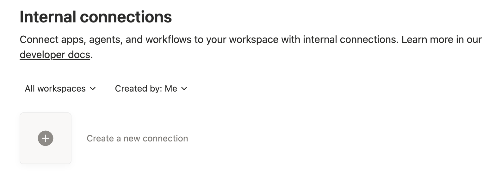
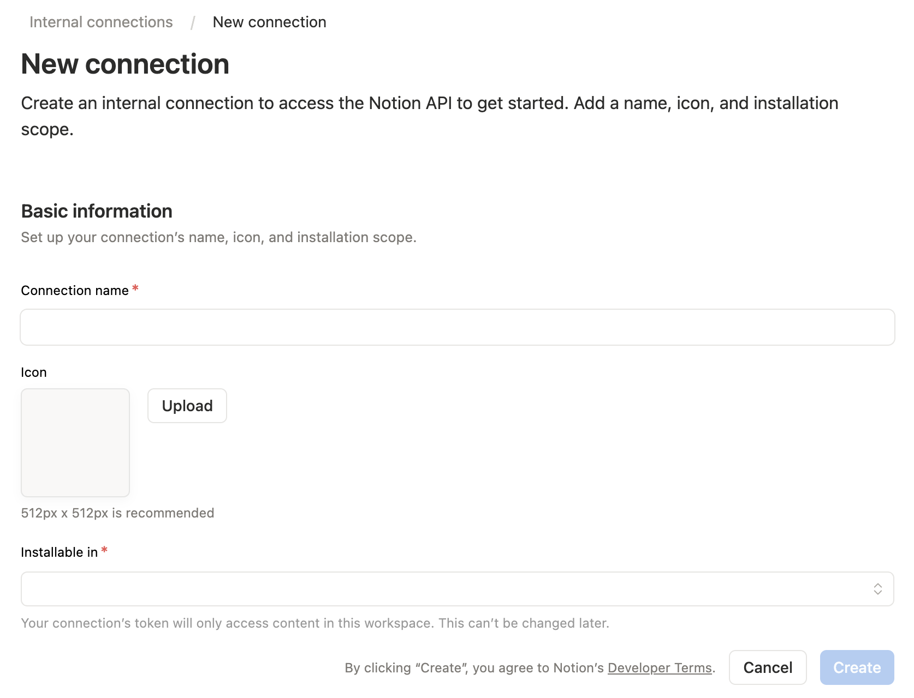
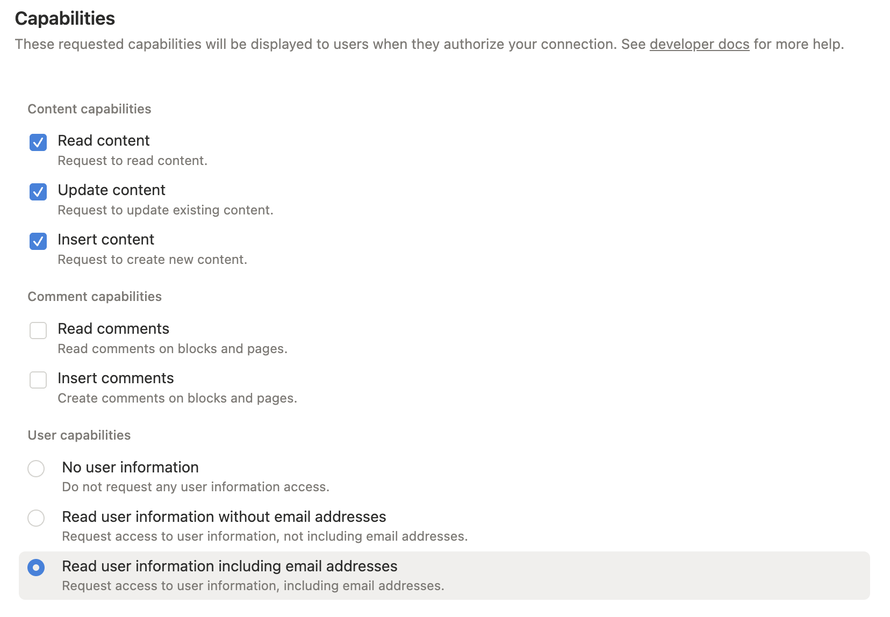
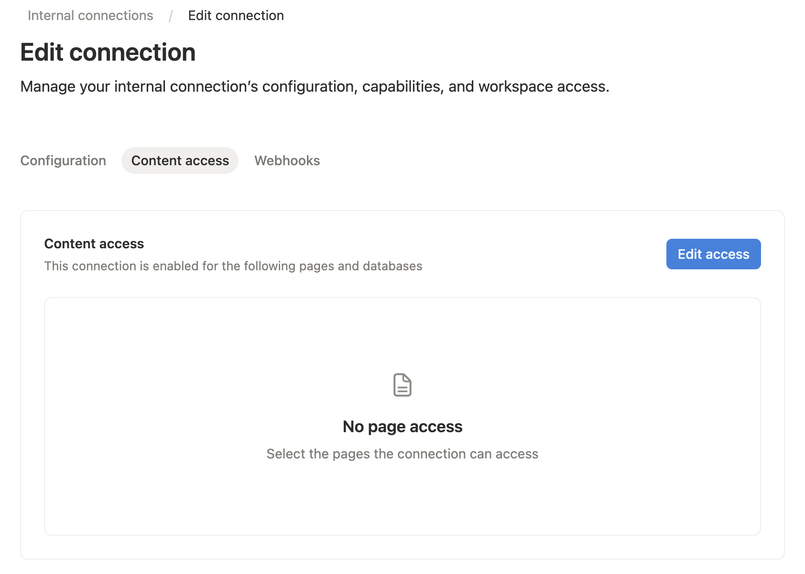
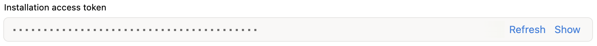

# Notion MCP Server

AI-friendly MCP server for the Notion API. It helps agents find, read, query, and update Notion workspaces while keeping responses compact enough for day-to-day AI workflows.

This server targets the Notion API `2026-03-11` and uses the current database/data source model. It exposes MCP tools, prompts, resources, structured tool results, and optional MCP Apps for interactive Notion workflows.

## Highlights

- Search and target discovery with `notion_find`.
- Compact page reading with stable block IDs via `notion_read_page`.
- Data source schema inspection with `notion_inspect_data_source`.
- Schema-aware data source querying and item creation with simple values.
- Simple page editing tools for paragraphs, headings, lists, todos, quotes, callouts, code blocks, dividers, and safe Markdown append.
- Raw Notion API tools for advanced block, page, database, data source, comment, and user operations.
- Optional MCP Apps: Data Source Explorer and Page Workbench.

## Quick Start

Add this server to an MCP host such as Claude Desktop:

```json
{
  "mcpServers": {
    "notion": {
      "command": "npx",
      "args": ["-y", "@suekou/mcp-notion-server"],
      "env": {
        "NOTION_API_TOKEN": "your-integration-token"
      }
    }
  }
}
```

Restart your MCP host after saving the configuration.

## Setup Guide

### 1. Create a Notion integration

Open the [Notion integrations dashboard](https://www.notion.so/profile/integrations), then create a new internal integration.




### 2. Configure capabilities

Grant only the capabilities you need:

- Read content: required for search, page reads, data source retrieval, and queries.
- Insert content: required for creating pages/items and appending blocks.
- Update content: required for updating pages, blocks, and data source schemas.
- Read comments / Insert comments: required only for comment tools.
- User information: required only when using user lookup tools.

For full functionality during setup, enable read, insert, and update content. Add comment or user capabilities only if you plan to use those tools.



### 3. Grant content access

Open the **Content access** tab for your integration, then select the pages or databases you want the MCP server to read or edit.

You can also grant access from the target Notion page or database: open the `...` menu, choose **Connections**, then add your integration.

Notion only lets an integration access pages and databases that have been shared with it. A connection added to a page can also access that page's children.



### 4. Copy the internal integration token

Copy the integration secret. This value becomes `NOTION_API_TOKEN` in your MCP host config.



### 5. Configure your MCP host

For Cursor, Claude Desktop, and other MCP hosts, add this server config to your MCP settings:

```json
{
  "mcpServers": {
    "notion": {
      "command": "npx",
      "args": ["-y", "@suekou/mcp-notion-server"],
      "env": {
        "NOTION_API_TOKEN": "secret_xxxxxxxxxxxxxxxxxxxxxxxxxxxxxxxxxxxxxxxxxxx"
      }
    }
  }
}
```

For a locally built checkout:

```json
{
  "mcpServers": {
    "notion": {
      "command": "node",
      "args": ["/absolute/path/to/suekou-mcp-notion-server/build/index.js"],
      "env": {
        "NOTION_API_TOKEN": "secret_xxxxxxxxxxxxxxxxxxxxxxxxxxxxxxxxxxxxxxxxxxx"
      }
    }
  }
}
```

## Recommended Workflow

1. Use `notion_find` to locate a page or data source.
2. Use `notion_read_page` for page context and editable block IDs.
3. Use `notion_inspect_data_source` before querying or creating data source items.
4. Use `notion_query_data_source_by_values` and `notion_create_data_source_item_from_values` for common data source work.
5. Use `notion_append_markdown`, `notion_append_content`, `notion_update_content`, or `notion_update_content_batch` for normal page edits.
6. Fall back to raw JSON tools only when the simplified tools do not cover the Notion API shape you need.

## For Developers

These references are mainly for development, customization, and advanced MCP workflows:

- [Configuration](docs/configuration.md): environment variables, command-line arguments, MCP host examples, development commands, and troubleshooting.
- [Tools](docs/tools.md): complete tool reference grouped by workflow area.
- [Workflows](docs/workflows.md): practical read, write, data source, migration, and error-handling guidance.
- [MCP Apps](docs/mcp-apps.md): interactive Data Source Explorer and Page Workbench details.

## Development

This project uses Node.js 22 or newer and pnpm.

```bash
pnpm install --frozen-lockfile
pnpm run build
pnpm test
```

Use the MCP inspector during local development:

```bash
pnpm run inspector
```

## License

This MCP server is licensed under the MIT License. This means you are free to use, modify, and distribute the software, subject to the terms and conditions of the MIT License. For more details, please see the LICENSE file in the project repository.
